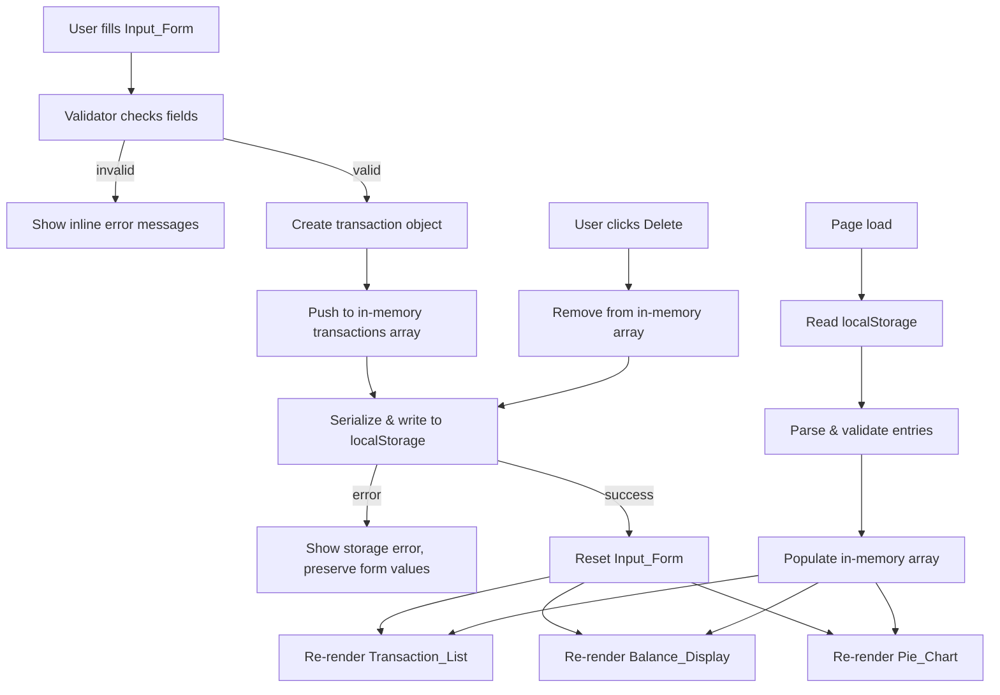

# Design Document: Expense Tracker

## Overview

The Expense Tracker is a single-page web application (SPA) titled **"Expense & Budget Visualizer"**. It is delivered as `index.html` with a linked `css/style.css` and `js/app.js`. It requires no build step, no server, and no external runtime dependencies beyond the Chart.js library loaded from a CDN. All state lives in the browser's `localStorage` under the key `"transactions"`.

### UI Layout (target)

```
┌─────────────────────────────────────────────────────┐
│           Expense & Budget Visualizer               │  ← page title (h1)
├─────────────────────────────────────────────────────┤
│  ┌───────────────────────────────────────────────┐  │
│  │  TOTAL BALANCE                                │  │  ← Balance_Display card
│  │           $3.56  (large blue text)            │  │
│  └───────────────────────────────────────────────┘  │
├─────────────────────────────────────────────────────┤
│  ┌───────────────────────────────────────────────┐  │
│  │  Add Transaction                              │  │  ← Input_Form card
│  │  Item Name: [________________]                │  │
│  │  Amount:    [________________]                │  │
│  │  Category:  [Food          ▾]                 │  │
│  │  [        Add Transaction        ] (blue btn) │  │
│  └───────────────────────────────────────────────┘  │
├──────────────────────────┬──────────────────────────┤
│  Transactions            │  Spending by Category    │  ← two-column row
│  ┌────────────────────┐  │  ┌──────────────────┐   │
│  │ Shopping           │  │  │   [Pie Chart]    │   │
│  │ $3.56 (blue)       │  │  │                  │   │
│  │ [Fun] (badge)      │  │  │ ● Food           │   │
│  │              [Del] │  │  │ ● Transport      │   │
│  ├────────────────────┤  │  │ ● Fun            │   │
│  │ Clok               │  │  └──────────────────┘   │
│  │ $14.94 (blue)      │  │                          │
│  │ [Food] (badge)     │  │                          │
│  │              [Del] │  │                          │
│  └────────────────────┘  │                          │
└──────────────────────────┴──────────────────────────┘
```

Key visual details from the target design:
- Page background: light grey (`#f0f2f5` or similar)
- Cards: white background, subtle box-shadow, rounded corners
- Balance amount: large font (~2.5rem), blue color (`#3b82f6` or similar)
- "TOTAL BALANCE" label: small uppercase grey text above the amount
- Form submit button: full-width, blue background, white text
- Transaction list items: item name in bold dark text, amount in blue, category as a small grey pill/badge below
- Delete button: red background (`#ef4444`), white text, right-aligned in each row
- Bottom section: two equal-width columns side by side (Transactions left, Pie Chart right)
- Pie chart colors: Food = green (`#22c55e`), Transport = blue (`#3b82f6`), Fun = orange (`#f97316`)

The application follows a simple **event-driven MVC-lite** pattern:

- **Model** — a plain JavaScript array of transaction objects held in memory and mirrored to `localStorage`.
- **View** — DOM manipulation functions that re-render the transaction list, balance display, and pie chart from the current model state.
- **Controller** — event listeners on the form and transaction list that call model mutations and then trigger view re-renders.

Because there is no virtual DOM or reactive framework, every mutation follows the same cycle:

```
User Action → Validate → Mutate Model → Persist to Storage → Re-render Views
```

This keeps the data flow predictable and easy to reason about.

---

## Architecture

### File Structure

```
expense-tracker/
├── index.html        # Markup and CDN script tags
├── css/
│   └── style.css     # Single stylesheet — the only CSS file in this folder
└── js/
    └── app.js        # Single JavaScript module — the only JS file in this folder
```

**Folder rules (enforced):**
- `css/` must contain exactly one file: `style.css`. No additional CSS files are permitted.
- `js/` must contain exactly one file: `app.js`. No additional JS files are permitted.
- All logic (TransactionStore, Validator, Formatter, Renderer, Controller) lives in `js/app.js`.
- All styles live in `css/style.css`.
- Code must be clean and readable: consistent indentation, descriptive variable names, and section comments separating each module.

### Dependency

| Library   | Version | Source                                      |
|-----------|---------|---------------------------------------------|
| Chart.js  | 4.x     | `https://cdn.jsdelivr.net/npm/chart.js`     |

Chart.js is loaded via a `<script>` tag in `<head>` with `defer` or just before the closing `</body>` tag. No other external dependencies are required.

### High-Level Data Flow



---

## Components and Interfaces

### 1. TransactionStore (Model)

Responsible for all reads and writes to the in-memory array and `localStorage`.

```js
// Public interface
TransactionStore = {
  load()           // → Transaction[]  — reads & validates from localStorage
  getAll()         // → Transaction[]  — returns current in-memory array
  add(tx)          // → void           — appends tx, persists; throws StorageError on failure
  remove(id)       // → void           — removes by id, persists; throws StorageError on failure
  _persist()       // → void (private) — JSON.stringify + localStorage.setItem
}
```

**Design decision**: `add` and `remove` throw a `StorageError` (a custom Error subclass) when `localStorage.setItem` fails. The controller catches this and shows the error message without mutating the in-memory array (i.e., the in-memory state is only updated *after* a successful persist).

### 2. Validator

Pure functions with no side effects. Returns a result object rather than throwing.

```js
// Public interface
Validator = {
  validateForm(name, amount, category)
  // → { valid: boolean, errors: { name?: string, amount?: string, category?: string } }

  validateTransaction(obj)
  // → boolean — used during localStorage deserialization
}
```

Validation rules:
- `name`: non-empty string, trimmed length 1–100 characters.
- `amount`: numeric string or number, parsed value in range `[0.01, 999_999_999.99]`, finite, not NaN.
- `category`: one of `"Food"`, `"Transport"`, `"Fun"` (exact string match).

### 3. UI Renderer (View)

A set of pure render functions that accept the current state and update the DOM. Each function is idempotent — calling it twice with the same data produces the same DOM.

```js
// Public interface
Renderer = {
  renderTransactionList(transactions)  // → void
  renderBalance(transactions)          // → void
  renderPieChart(transactions)         // → void
  showFormErrors(errors)               // → void
  clearFormErrors()                    // → void
  showStorageError(message)            // → void
  showEmptyState(containerId)          // → void
}
```

**Chart.js update strategy**: A single `Chart` instance is created on first render and stored in a module-level variable. On subsequent calls to `renderPieChart`, the existing instance's `data.labels`, `data.datasets[0].data`, and `data.datasets[0].backgroundColor` are mutated in place, then `chart.update()` is called. This avoids the "canvas already in use" error and is the [recommended Chart.js update pattern](https://www.chartjs.org/docs/latest/developers/updates.html). If no transactions exist, the chart instance is destroyed and an empty-state message is shown instead.

### 4. Controller (Event Wiring)

Thin glue layer that connects DOM events to the model and renderer.

```js
// Wired on DOMContentLoaded
Controller = {
  init()           // loads data, renders initial state, attaches listeners
  onFormSubmit(e)  // validates → add → re-render or show errors
  onDeleteClick(e) // remove → re-render
}
```

### 5. Formatter

Utility functions for display formatting.

```js
Formatter = {
  currency(amount)   // → string, e.g. "$1,234.56"
  // Uses Intl.NumberFormat('en-US', { style: 'currency', currency: 'USD' })
}
```

---

## Data Models

### Transaction Object

```js
/**
 * @typedef {Object} Transaction
 * @property {string} id        - UUID v4 generated at creation time (crypto.randomUUID())
 * @property {string} name      - Item name, 1–100 characters (trimmed)
 * @property {number} amount    - Positive number, 0.01–999,999,999.99
 * @property {string} category  - One of "Food" | "Transport" | "Fun"
 * @property {number} createdAt - Unix timestamp (Date.now()) for ordering
 */
```

**ID generation**: `crypto.randomUUID()` is available in all modern browsers (Chrome 92+, Firefox 95+, Edge 92+, Safari 15.4+) and works under `file://` protocol. No polyfill is needed for the target browser matrix.

### localStorage Schema

```
Key:   "transactions"
Value: JSON string of Transaction[]

Example:
[
  {
    "id": "a1b2c3d4-...",
    "name": "Lunch",
    "amount": 12.50,
    "category": "Food",
    "createdAt": 1700000000000
  }
]
```

### Validation Schema (for deserialization)

An entry read from `localStorage` is considered valid if and only if:
- `id` is a non-empty string
- `name` is a non-empty string with trimmed length ≤ 100
- `amount` is a finite number in `[0.01, 999_999_999.99]`
- `category` is exactly `"Food"`, `"Transport"`, or `"Fun"`
- `createdAt` is a finite positive number

Entries failing any check are silently discarded (Requirement 5.5).

### Category Aggregation (for Pie Chart)

```js
// Derived from Transaction[] at render time — not stored
CategoryTotals = {
  Food:      number,  // sum of amounts where category === "Food"
  Transport: number,  // sum of amounts where category === "Transport"
  Fun:       number,  // sum of amounts where category === "Fun"
}
// Only categories with total > 0 are passed to Chart.js
```

---

## Correctness Properties

*A property is a characteristic or behavior that should hold true across all valid executions of a system — essentially, a formal statement about what the system should do. Properties serve as the bridge between human-readable specifications and machine-verifiable correctness guarantees.*

### Property 1: Transaction serialization round-trip

*For any* array of valid transaction objects, serializing it to a JSON string and then deserializing and validating it should produce an array that is deeply equal to the original, with all fields (id, name, amount, category, createdAt) preserved and the original insertion order maintained.

**Validates: Requirements 5.1, 5.2, 5.3, 2.3**

---

### Property 2: Invalid entries are discarded on load

*For any* array where some entries are valid transactions and others are malformed (missing required fields, wrong types, out-of-range values, or extra garbage), parsing and validating that array should return only the valid entries and silently discard the rest, without throwing an error.

**Validates: Requirements 5.5**

---

### Property 3: Balance equals the sum of all transaction amounts

*For any* list of transactions (including the empty list), the balance value computed by the balance renderer should equal the arithmetic sum of all `amount` fields in the list, formatted as a currency string with a `$` prefix, thousands separator, and exactly two decimal places. For an empty list the result must be `$0.00`.

**Validates: Requirements 3.2, 3.3, 3.4, 3.5**

---

### Property 4: Category totals are consistent with the transaction list

*For any* list of transactions, the labels and data values passed to the pie chart renderer should equal the per-category sums of `amount` across all transactions, and every category whose total is zero should be absent from the chart data entirely.

**Validates: Requirements 4.1, 4.2, 4.3, 4.4**

---

### Property 5: Whitespace-only and empty names are rejected

*For any* string composed entirely of whitespace characters (spaces, tabs, newlines, or any combination thereof), the Validator should return `valid: false` with an error on the `name` field, and no transaction should be added to the list.

**Validates: Requirements 1.3**

---

### Property 6: Out-of-range amounts are rejected

*For any* value that is zero, negative, non-finite (NaN or ±Infinity), or strictly greater than 999,999,999.99, the Validator should return `valid: false` with an error on the `amount` field, and no transaction should be added to the list.

**Validates: Requirements 1.4**

---

### Property 7: Add then delete restores prior state

*For any* initial transaction list and any single new valid transaction, adding that transaction and then immediately deleting it by its id should produce a transaction list that is deeply equal to the original list — same length, same entries, same order.

**Validates: Requirements 1.2, 2.6, 5.1, 5.2**

---

### Property 8: Currency formatting produces a well-formed string

*For any* finite non-negative number, `Formatter.currency` should return a string that begins with `$`, contains exactly one decimal point, and has exactly two digits after the decimal point.

**Validates: Requirements 2.1, 3.2**

---

## Error Handling

### Storage Failures

`localStorage` can throw in two scenarios:
1. **QuotaExceededError** — storage is full.
2. **SecurityError** — storage is blocked (private browsing in some browsers, or `file://` with certain browser settings).

**Strategy**: Wrap all `localStorage` calls in `try/catch`. On write failure during form submission, the in-memory array is **not** mutated (the transaction is not added), the form values are preserved, and a visible error banner is shown. On read failure at startup, the app initializes with an empty array and renders normally.

### Corrupt / Partial Data

On load, each entry in the parsed array is individually validated. Valid entries are kept; invalid entries are silently dropped. If the top-level value is not an array (e.g., a plain string or object), the entire value is discarded and the app starts with an empty list.

### Chart.js Initialization Failure

If `Chart` is not defined (CDN load failure), `renderPieChart` should catch the `ReferenceError` and display a fallback message rather than crashing the app. This satisfies Requirement 7.4 (no unhandled JavaScript errors).

### Form Validation Errors

Inline error messages are displayed adjacent to each invalid field. Errors are cleared on the next successful submission or when the user modifies the field. No alert dialogs are used.

---

## Testing Strategy

### Unit Tests

Use a standard JavaScript test runner. [Vitest](https://vitest.dev/) is recommended because it runs in Node.js without a browser and works without a build step for plain ES modules.

Focus areas for unit tests:
- **Validator**: specific valid and invalid inputs for name, amount, and category fields.
- **Formatter.currency**: spot-check known values (`0` → `$0.00`, `1234.5` → `$1,234.50`, `999999999.99` → `$999,999,999.99`).
- **TransactionStore deserialization**: arrays with all-valid, all-invalid, and mixed entries.
- **Category aggregation**: known transaction sets produce expected totals.

### Property-Based Tests

Use [fast-check](https://fast-check.io/) for property-based testing. Each property test runs a minimum of **100 iterations**.

Tag format for each test: `// Feature: expense-tracker, Property N: <property text>`

| Property | Test Description | Generator Inputs | Validates |
|----------|-----------------|-----------------|-----------|
| P1 | Serialization round-trip preserves data and order | Arbitrary valid `Transaction[]` | 5.1, 5.2, 5.3, 2.3 |
| P2 | Invalid entries discarded on load | Mixed arrays of valid + malformed objects | 5.5 |
| P3 | Balance equals sum of amounts | Arbitrary valid `Transaction[]` (including empty) | 3.2, 3.3, 3.4, 3.5 |
| P4 | Category totals consistent with transaction list | Arbitrary valid `Transaction[]` | 4.1, 4.2, 4.3, 4.4 |
| P5 | Whitespace-only names rejected | Strings of whitespace characters | 1.3 |
| P6 | Out-of-range amounts rejected | Numbers outside `[0.01, 999_999_999.99]`, NaN, Infinity | 1.4 |
| P7 | Add-then-delete restores prior state | Arbitrary valid `Transaction[]` + one new transaction | 1.2, 2.6, 5.1, 5.2 |
| P8 | Currency formatting produces well-formed string | Arbitrary non-negative finite numbers | 2.1, 3.2 |

### Integration / Smoke Tests

Manual or automated browser tests (e.g., Playwright) for:
- App loads and renders correctly via `file://` protocol in Chrome, Firefox, Edge, Safari.
- Adding a transaction updates all three UI components within 300 ms.
- Deleting a transaction updates all three UI components within 300 ms.
- Refreshing the page restores all previously saved transactions.
- WCAG AA contrast ratios verified with browser DevTools accessibility audit.

### Test Configuration

```js
// vitest.config.js (if using Vitest)
export default {
  test: {
    environment: 'node',  // pure logic tests; DOM tests use jsdom
    include: ['**/*.test.js'],
  }
}
```

Property tests should be co-located with unit tests and imported from the same test file:

```js
// Example tag comment
// Feature: expense-tracker, Property 1: Transaction serialization round-trip
fc.assert(fc.property(arbitraryTransactionArray, (txs) => {
  const serialized = JSON.stringify(txs);
  const restored = parseAndValidate(serialized);
  return deepEqual(restored, txs);
}), { numRuns: 100 });
```
